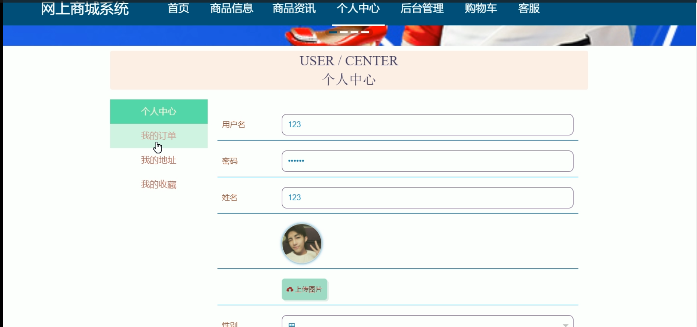

# 基于springboot框架的网上商城系统

---
### 👉作者QQ ：1556708905 微信：zheng0123Long (支持定制修改、部署调试、定制毕设)

### 👉接网站建设、小程序、H5、APP、各种系统等

---

#### 介绍

我开发的基于Spring Boot框架的网上商城系统旨在提供一个高效、便捷、安全的在线购物平台。系统采用现代化的设计理念，结合Spring Boot的强大功能，实现了用户友好的购物体验和高效的后台管理。系统分为两种角色：管理员和用户，每个角色都有相应的功能模块，以满足不同用户的需求。

#### 技术栈

后端技术栈：Springboot+Mysql+Maven

前端技术栈：Vue+Html+Css+Javascript+ElementUI

开发工具：Idea+Vscode+Navicate

#### 系统功能介绍

管理员角色功能模块    
个人中心：管理员可以管理个人信息，包括修改密码、更新联系方式等，确保管理员个人信息的准确性和安全性。  
用户管理：管理员可以管理注册用户的信息，包括添加、修改、删除用户，查看用户的购物记录和活动日志，帮助解决用户问题。  
商品分类管理：管理员可以管理商品的分类，添加、修改和删除商品分类，确保商品分类的清晰和合理。  
商品信息管理：管理员可以管理商品的信息，包括添加新商品、编辑商品详情、删除过时商品，维护商品的准确性和更新性。  
商品评价管理：管理员可以查看和管理用户对商品的评价，删除不当评价，回复用户的评论，提升用户购物体验。  
系统管理：管理员可以进行系统的整体管理和维护，包括系统设置、权限管理、日志记录等，确保系统的稳定运行和安全。  
订单管理：管理员可以查看和管理所有订单信息，包括订单的生成、处理、发货和售后服务，确保订单流程的顺畅和高效。  

用户角色功能模块  
商品信息：用户可以浏览系统中的所有商品信息，包括商品的详细描述、价格、库存情况等，方便用户选择合适的商品。  
商品资讯：用户可以查看与商品相关的资讯和新闻，了解最新的商品动态和促销信息，帮助用户做出更好的购买决策。  
个人中心：用户可以管理个人信息，包括修改密码、更新联系方式、查看个人订单和购物记录，确保个人信息的准确性和安全性。  
后台管理：  
商品评价管理：用户可以查看自己对商品的评价记录，修改或删除评价，保持评价的连贯性和真实性。  
我的收藏管理：用户可以管理自己收藏的商品，方便日后查阅和购买，提升购物体验。  
订单管理：用户可以查看和管理自己的订单信息，包括订单的状态、物流信息、售后服务等，确保订单处理的及时性和准确性。  
购物车：用户可以将选中的商品加入购物车，方便集中结算和购买，提高购物的便利性。  
客服：用户可以通过客服功能与商家沟通，咨询商品信息、订单问题和售后服务，确保购物过程的顺畅和满意。  

#### 系统作用

该网上商城系统的主要作用包括：

提供便捷的在线购物平台：系统为用户提供了丰富的商品信息和便捷的购物流程，用户可以随时随地进行商品浏览和购买，提升购物体验。  
高效的后台管理：管理员可以通过系统高效地管理用户、商品和订单，确保商城运营的顺畅和高效。  
促进用户与商家的互动：通过商品评价管理和客服功能，用户可以与商家进行互动，反馈购物体验，咨询商品信息，提升用户满意度。  
保障系统的安全性和稳定性：系统管理功能确保了系统的稳定运行和信息安全，保护用户和管理员的个人信息和交易数据。  

#### 系统功能截图

代码结构

数据库表

登录

用户管理

商品信息管理

系统管理

前台页面首页

个人中心

购物车

客服

用户端后台管理

#### 总结

基于Spring Boot框架的网上商城系统通过管理员和用户两种角色，实现了商品信息管理、订单管理、用户管理、商品评价管理和个人中心等功能，为用户提供了一个高效便捷的购物平台。系统通过科学的功能模块设计和高效的管理机制，确保了平台的稳定运行和信息的安全，为在线购物提供了强有力的支持。管理员和用户可以通过系统实现高效的管理和便捷的购物，提升了购物体验和商城运营效率。

#### 使用说明

创建数据库，执行数据库脚本 修改jdbc数据库连接参数 下载安装maven依赖jar 启动idea中的springboot项目

网址：http://localhost:8080/wangshangshangchengB/admin/dist/index.html#/login 后台管理

      http://localhost:8080/wangshangshangchengB/front/index.html 前台

管理员  admin  密码：admin     